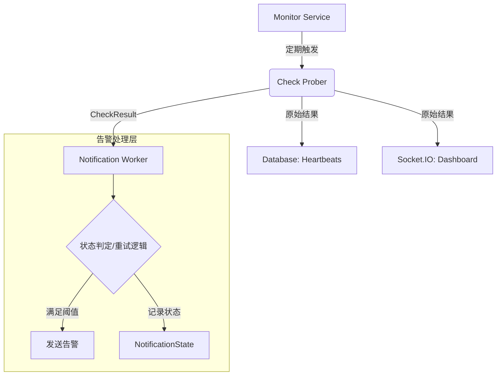

# 监控逻辑与架构设计

本文档详细描述了 PingGo 监控系统的核心逻辑、重试机制以及告警触发流程。

## 1. 核心架构概览

系统采用“**探测与告警分离**”的设计原则。探测层负责获取实时数据并记录，告警层根据配置的规则进行状态判定和通知。

---

## 2. 探测逻辑 (`Check`)

探测任务（HTTP, Ping, TCP, DNS）由 `monitor/service.go` 中的 `Check` 函数执行。

- **实时记录**：探测得到的**原始结果**（Status, Message, Duration）会立即保存到 `Heartbeats` 表中。
- **即时反馈**：通过 Socket.IO 将原始结果推送到前端，确保仪表盘上的“绿红条”实时反映每次探测的真实情况，不受重试逻辑干扰。
- **状态同步**：数据库中 `Monitor` 表的 `status` 字段始终与最后一次探测结果保持一致。

---

## 3. 重试与告警逻辑

重试逻辑已从监控项配置中剥离，移动到了**通知规则**中。这允许针对同一监控项设置不同灵敏度的告警（例如：关键任务 0 次重试，非关键任务 3 次重试后报警）。

### 3.1 状态管理 (`NotificationState`)

Notification Worker 在内存中维护每个“规则-监控项”对的状态：
- `ConsecutiveFailures`: 连续失败次数。
- `ConsecutiveSuccesses`: 连续成功次数。
- `LastSentStatus`: 该规则最后一次确认的“硬状态”。

#### 初始同步与立即武装
为了避免规则开启后的“监控真空期”，系统采取“**疑病从无**”的初始化策略：
- **首次遇见**：当 Worker 第一次遇到某个监控项（或规则刚开启）时，立即将探测到的实时状态设为 `LastSentStatus` 的初始值。
- **作用**：确保规则立即进入“已武装”状态。如果初始状态为 `UP`，下一次符合阈值的故障将立刻触发状态切换通知。

### 3.2 判定流程与重置

当 Worker 接收到探测结果时：

1.  **更新计数器**：
    - 若探测失败：`ConsecutiveFailures++`，`ConsecutiveSuccesses = 0`。
    - 若探测成功：`ConsecutiveSuccesses++`，`ConsecutiveFailures = 0`。

2.  **确定“硬状态” (Hard Status)**：
    - **阈值定义**：令 `T = max(1, ConfigValue)`。输入 0 或 1 均视为 1 次探测即触发。
    - **故障判断**：只有当 `ConsecutiveFailures >= ThresholdDown` 时，判定硬状态为 `DOWN`。
    - **恢复判断**：只有当 `ConsecutiveSuccesses >= ThresholdUp` 时，判定硬状态为 `UP`。
    - **中间态**：若未达到上述阈值，硬状态保持不变。

3.  **触发通知**：
    - 只有当“硬状态”发生改变，且符合规则配置（如：`on_status=down` 或 `on_status=change`）时，才会触发邮件发送。

4.  **实时重置机制 (State Reset)**：
    为了确保告警判定永远基于最新的配置和最清爽的状态，系统在以下场景会调用判定计数器清空逻辑：
    - **联动触发重置**：
        - **通知规则层**：点击开启规则、保存规则修改。
        - **监控对象层**：**点击恢复监控、暂停监控、保存监控项修改**。
    - **系统重启**：由于判定计数器存储在内存中，程序重启后将自动清空所有历史状态。

5.  **初始化与“武装”原则**：
    无论是系统启动还是执行了上述重置操作，规则接收到的**第一个探测结果**将作为“初始基准”：
    - **同步状态**：直接将该结果设为 `LastSentStatus`（基准状态）。
    - **静默武装**：此次不发通知，仅完成初始化。
    - **后续判定**：从第二个结果起，任何符合阈值的状态切换都将立刻触发报警。

---

## 4. 核心防御：报警滞后区间 (Hysteresis)

通过 `MaxRetries` 和 `MaxRetriesRecovery` 的组合，系统构建了一个高效的**报警滞后区间**，有效解决“报警抖动（Flapping）”：

- **针对 Down 报警**：即便只关心宕机通知，也应配置“恢复重置次数”。它定义了报警的“解除门槛”。只有服务真正稳定了，系统才会重置其报警状态，从而避免因瞬时恢复导致的重复宕机通知。
- **针对 Up 报警**：同理，需要配置“失败判定期”。只有确定服务已经历了真实的不可用过程，随后的恢复通知才具有参考价值。

---

## 5. 关键设计优势

- **数据透明度**：仪表盘能看到细微的服务波动，不会被重试机制“抹平”。
- **精细化控制**：不同的通知渠道可以根据其重要性设置不同的重试阈值。
- **高可靠性**：自动初始化与实时重置机制确保了告警在规则变更后依然是精准且及时的。
- **抗干扰设计**：滞后区间设计在大规模网络波动下能保持告警列表的整洁。
